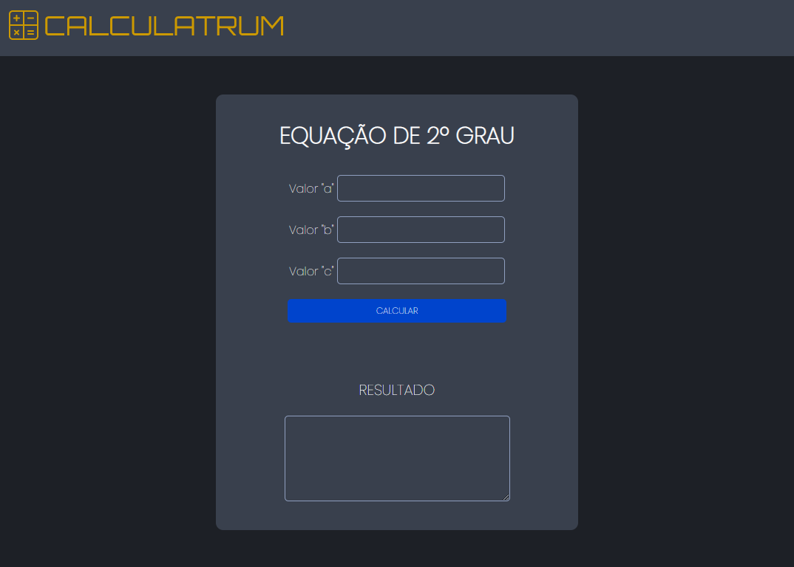

<h1 align="center"> Calculadora de Equação de 2º Grau</h1>

Projeto Interdisciplinar realizado em aula das disciplinas de Programação Web I, Programação e Algoritmos e Design Digital da ETEC Professor Horácio Augusto da Silveira.

  <a href="#-tecnologias">Tecnologias</a>&nbsp;&nbsp;&nbsp;|&nbsp;&nbsp;&nbsp;
  <a href="#-projeto">Projeto</a>&nbsp;&nbsp;&nbsp;|&nbsp;&nbsp;&nbsp;
  <a href="#-layout">Layout</a>&nbsp;&nbsp;&nbsp;|&nbsp;&nbsp;&nbsp;

 

  

## 🚀 Tecnologias

Esse projeto foi desenvolvido com as seguintes tecnologias:

- HTML e CSS
- JavaScript

## 💻 Projeto

A Calculadora de Equação 2º Grau é um projeto feito com objetivo de chegar rapidamente ao resultado da equação.

## 🔖 Layout

Todo o design do projeto foi feito no Figma. Você pode visualizar o layout do projeto através [DESSE LINK](https://www.figma.com/file/zMyNchGyYN9dcdaAul8aLW/Calculadora-Equa%C3%A7%C3%A3o-Segundo-Grau?type=design&mode=design&t=yfrS9LgQf6DpRd4T-1).